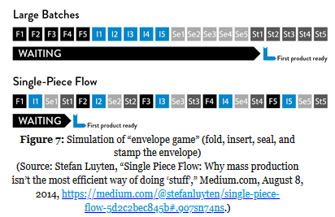

# Chapter 2: The First Way: The Principles of Flow

* Foscuses on the smooth flow of work from Dev to Ops, to deliver customer value quickly
* Optimize for this global goal **over** local goals like:
  * Feature completion rates
  * Test find/fix ratios
  * Ops availability measures
* This is done by:
  * Making work visible
  * Reducing batch sizes
  * Reduce intervals of work
  * Building quality in
  * Preventing defects from being passed downstream
* Goal is to:
  * Decrease amount of time required for changes to be deployed
  * Increase reliability of those services

## Limit Work In Progress

* Unfortunately, work becomes dominated by priority *du jour*
* Breaking the focus of a machine worker means the part he was working on gets thrown out
  * Breaking the focus of a developer has no visible side effects...

## Reduce Batch Sizes

* Imagine folding 45 pieces of paper to be mailed
  * Only to realize on the 45th that you folded them in a way that doesnt fit in an envelope...
* Remember the tripod building...

## Reduce the Number of Handoffs

* On each handoff, some portion of knowledge is lost...

## Continually Identify and Elevate our Constraints

* Consider a constraint:
  * Optimizing before the constraint causes a pileup
  * Optimizing afterwards starves downstream
* Use these steps to mitigate bottleneck issues
  * Identify the systems constraint
  * Decide how to exploit the systems constraint
  * Subordinate everything else to the above decisions
  * Elevate the systems constraint
  * IF in the previous steps a constraint has been broken, go back to step one, but do not allow inertia to cause a system constraint

### Typical Constraints

* Environment Creation:
  * We cannot achieve deployments on demand if production and test envionments arent easily avail
* Code Deployment
  * Automate deployments as much as possible
  * Ideally completely automated
* Test Setup and Run
  * Need to automate as much as possible
  * Must also run in a timeframe that can keep pace with the development rate
* Overly Tight Architecture
  * Keep architectures loose so that changes can be made without affecting the rest of the system

### Eliminate Hardships and Waste in the Value Stream

* Partially done work
  * Any work in the value stream that hasnt been completed
  * This becomes obsolete and loses value as time progresses
* Extra processes
  * Extra work being done that does not add value to the customer (like back buttons)
  * Can include documentation not used in downstream work
  * Reviews or approvals taht dont add value to the output
* Extra features
  * "Gold plating"
  * These add complexity and effort
* Task switching
* Waiting
* Motion
  * Waste occurs when you have to go through more actions than should be neccessary to complete something
  * Like communicating with people far away
* Defects
  * The longer time between defect creation and detection, the more difficult it is to resolve
* Nonstandard or manual work
  * Reliance on anything that cant be automated is a liability
* Heroics
  * If anyone has to do anything unreasonable to bring it to production, thats a big problem
