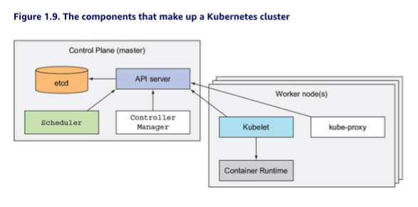

# Chapter 1. Introducing Kubernetes

With bigger numbers of deployable components and increasingly larger datacenters, it becomes increasingly difficult to configure, manage, and keep the whole system running smoothly

- We need automation
  - automatic scheduling of those components to out servers
  - automatic configuration, supervision, and failure handling

This is where kubernetes comes in

- Allows developers to deploy applications themselves, and as often as they want
  - does not require any assistance from the ops team
- Also benefits ops team by automatically monitoring and rescheduling apps in the event of a hardware failure
  - Focus fof sysadmins shifts from supervising individual apps to supervising and managing the rest of the infrastructure
  - kubernetes takes care of the apps

*kubernetes* is greek for pilot or helmsman

- abstracts away the hardware infrastructure and exposes the whole datacenter as a single enormous computational resource **POG**

## 1.1 Understanding the need for a system like Kubernets

### 1.1.1 Moving from monolithic apps to microservices

Monolithic applications

- consist of components that are all tightl coupled
- must be developed, deployed, and managed as one entity - because they all run as a single OS process
- Changes to one part of the application require a redeployment of the whole application
  - over time the lack of hard boundaries between parts rsults in increasing complexity and deterioration of the quality of the whole system
- usually these run on a small number of powerful servers
  - vertically scale (more cpu, more memory)
  - horizontally scale (more copies on more servers)
  - certain parts may scale easy, but some parts are impossible (like relational dbs)
  - if any part of the monolith isnt scalable, the whole app becomes unscalable (Unless you can split up the monolith somehow)

#### Splitting Apps into Microservices

Each microservice runs as an independent process

They all communicate with other microservices though simeple, well-defined interfaces (APIs)

Protocols:

- Synchronous:
  - HTTP, where they expose:
    - RESTful APIs
- Asynch
  - AMQP (Advanced Message Queueing Protocol)

Developable and deployable independently

- changes to one doesnt require changes or redeployment of any other service

#### Scaling Microservices

- done on a per device service
- only scale services that require more resources

#### Deploying Microservices

As always, microservices also have drawbacks

- When system consists of only a small number of deployable components, managing those components is easy
- Trivial to decide where to deploy each component, because there arent that many choices
- As comopnents increase, deployment-related decisions become increasinly difficult
  - number of configurations increase
  - number of interdependencies between components increases by an even greater factor
- Microservices work together as a team
  - need to find and talk to each other
  - when deploying them, **someone or something** needs to configure all of them properly to enable them to work together as a single system
  - with increasing numbers of microservices, becomes tedious and error prone
- debugging and trace execution calls become difficult because span multiple processes and machines
  - see **Zipkin**

#### Understanding the Divergence of Environment Requirements

- Divergence of dependencies between application components is an issue
  - applications require different versions of the same libraries
- Deploying dynamically linked applications that require different versions of shared libraries becomes a nightmare

### 1.1.2 Providing a consistent environment to applications

- hardware changes, os changes, libary changes
- production system must provide proper env to all applications it hosts
  - even though they may require different, even conflicting, versions of libraries

### 1.1.3. Moving to continuous delivery: DevOps and NoOps

Orgs realizing its bettwe to have the same team that develops the application also take part in deploying it, and taking care of it over its whole lifetime

#### Understanding the Benefits

App developers now much more inclined to

- give users the app earlier
- use their feedback to steer further development of the app

Gotta streamline baby - no waiting for ops people

#### Letting developers and SysAdmins Do What They Do Best

- Developers love creating new features and improving UX
  - Dont want to make sure underlying OS is up to date with security patches
- Ops teams care about system security, utilization
  - Dont want to deal with implicit interdependencies or how changes to the os or infrastructure can affect the app as a whole

**NoOps**: Ideally you want the developers to deploy the application themselves without knowing anything about the hardware infrastructure and without dealing with the ops team

Kubernetes enables this. By abstracting away actual hardware and exposing it as a single platform, allows the devs to configure and deploy their apps without help from sysadmins

## 1.2 Introducing container technologies

Gotta get **Docker** or **rkt** ("rock-it")

### 1.2.1. Understanding what containers are

When app is composed of only smaller numbers of large components, its completely acceptible to give a dedicated VM to each component, and isolate theeir environments by providing each of them with their own os instance

- as compnents get smaller and smaller, their numbers grow, and you cant give each their own VM
  - waste of money
  - waste of compute
  - waste of humans configuring

#### Isolating Components with Linux Container Technologies

- use linux containers babyy
- allow you to run multiple services on the same host machine
  - expose diff env to each of them
  - isolate them
  - like vms, but less overhead

#### comparing VMs to Containers

- containers are lightweight
  - allows running higher numbers of software components on the sam ehardware
  - vms require own set of system process, which requires additional compute in addition to the compute consumed by the components own process
- will typically end up grouping multiple apps onto each VM because you dont have enough resources to dedicate a whole VM to each app
- with containers, you can (and should) have one container for each application
- end result is you can fit many more applications on the same bare metal machine

Note: two types of hypervisors exist:

- Type 1: dont use a host OS
- Type 2: do use host os

Containers, all perform system call son the exact same kernel running in the host OS

- single kernel is the only one performing x86 instructions on the CPU
- CPU ddoesnt need to do any kind of virtualization

Main benefit of VMs is the full isolation they provide

Containers all run on the sam kernel - poses a security risk

#### Introducing the Mechanisms That Make Container Isolation Possible

- *Linux Namespaces* baby - makes sure each process sees its own personal view of the system (files, network interfaces, hostname, and so on)
- *Linux Control Groups (cgroups)* - limit the amount of resources the process can consume (CPU, memory, network bandwidth, and so on)

#### Isolating Processes With Linux Namespaces

By default, each linux system initially has one single namespace

All system resources, such as filesystems, process IDs, user IDs, network interfaces, etc, all belong to a single namespace

- tho, thou can create additional namespaces and organize resources across them

When running a process, you run it inside one of those namespaces, and the process will only see resources that are inside that namespace

Existing namespaces:

- Mount (mnt)
- Process ID (pid)
- Network (net)
- Inter-process communication (ipc)
- UTS
- User ID (user)

Each namespace kind is used to isolate a certain group of resources

UTS, for example, determines what hostname and domain name the process running inside that namespace sees

- by assigning two different UTS namespaces to a pair of processes, you can make them see different local hostnames
  - in other words: to the two processes, it wil appear as though they are running on two different machines (as far as the hostname is concerned)

Network namespace - can do similar

#### Limiting Resources Available to a Process

The other half of container isolation deals with limiting the amount of system resources a container can consume

- cgroups achieve this
- keeps processes from hogging resources reserved for other processes

### 1.2.2 Introducing the Docker Container Platform

Docker was first container system that made containers easily portable across different machines

- simplified process of packaging:
  - the application
  - all the libraries and dependencies
  - even the whole os filesystem
- simple, portable package

When you run an application packaged with Docker, it sees the exact file system contents that youve bundled with it. It sees the same files whether running on dev machine of prod machine (even if prod server running a completely different linux OS). The app wont see anything from the server its running on, so it doesnt matter if the server has a completely different set of installed libraries

A big difference between docker-based container images and vm images is that **container images are composed of layers** which can be shared and reused across multiple images

- only certain layers of an image need to be downloaded if the other layers were already downloaded previously

#### Understanding Docker Concepts

Docker is a platform for packaging, distributing, and running applications

- Images:
  - something you package an application and its env into
  - contains the filesystem and metadata
- Registries:
  - repo that stores your docker images and facilitates easy sharing of those images
  - when you build an image
    - can either run on computer it was built on
    - push (upload) image to a registry
    - pull (download) on another computer, and run there
- Containers:
  - docker-based container is a regular linux container created from a docker-based container image
  - a running container is a process running on the host running docker
    - but its completely isolated from both the host and all other processes running on it
  - resource constrained

#### Comparing Vitual Machines and Docker Containers

#### Understanding Image Layers

In addition to making distribution more efficient, help reduce storage footprint of images

- even if files are shared, still isolated
- image layers are read only
  - writable layers crated on top of the layers IN the image
- When the process int he container writes to a file located in one of the underlying layers, a copy of the whole file is created in the top-most layer and the process writes to the copy

#### Understanding the Portability Limitations of Container Images

In theory, container image can be run on any linux machine running docker... except for a small caveat

- if a containerized application requires a specific kernel version, it may not work on every machine

Cant containerize an app for x86 and expect it to run on ARM

Does **NOT** provide process isolation - actual isolation done at the linux kernel level via namespaces. Docker just makes it easy to use those features

### 1.2.3. Introducing rkt - an alternative to Docker

After success of Docker, Open Container Initiative (OCI) came about

**rkt** puts emphasis on:

- security
- composability
- conforming to opern standards
- uses OCI container format
- can run regular Docker container images

Book focuses on Docker because initially was only one supported by Kubernetes

## 1.3 Introducing Kubernetes

### 1.3.1. Understanding its origins

Born from Google - when you run hundred of thousands of machines, even tiny improvements in utilization can mean savings of millions of dollars

Kubernetes is open source version of internally developed *borg* and *omega*

### 1.3.2. Looking at Kubernetes from the Top of a Mountain

Kubernetes is a software system that allows you to easily deploy and manage containerized applications on top of it

- It relies on features of linux containers to run heterogeneous applications without having to know any internal details of these applications and without having to manually deploy these applications on each host

Enables you to run software applications on thoustands of computer nodes as if all those nodes were a single enormous computer

Deploying applications through Kubernetes is always the same, whether your cluster contains only a couple of nodes or thousands of them. The size of the cluster makes no difference at all

#### Understanding th core of What Kubernetes Does

- Developer
- App descriptor
- Kubernetes master (mAiN)
- Tens or thousands of worker nodes exposed as a single deployment platform

Developers can specify that certain apps must run together and Kubernetes will deploy them on the same worker node. Others will be spread around the cluster, but they can talk to each other in the same way, regardless of thwere theyre dpeloyed

#### Helping Developers Focus on the Core App Features

Kubernetes can be thought of as an operating system for the cluster

- service discovery
- scaling
- load balancing
- self healing
- leader election

#### Helping Ops Teams Achieve Better Resource Utilization

### 1.3.3 Understanding the architecture of a Kubernetes Cluster

At the hardware level, a Kubernetes cluster is composed of many nodes, which can be split into two types:

- *master* node
  - hosts the *Kubernetes Control Plane* that controls and manages the whole K8 system
- worker *nodes* that run the actual applications you deploy

#### The Control Plane

Controls the cluster and makes it function. Contains multiple components that can run on:

- single master node
- be split across multiple nodes (and replicated to ensure high availability)

These components are:

- The *K8 API Server*, which you and the other Control Plane components communicate with
- The *Scheduler*, which schedules you apps (assigns a worker node to each deployable component of your application)
- The *Controller Manager*, which performs cluster-level functions, such as replicating components, keeping track of worker nodes, handling node failures, and so on
- *etcd*, a reliable distributed data store that persistently stores the cluster configuration

#### The Nodes

The worker nodes are the machines that run your containerized applications. The task of running monitoring, and providing services to your applications is done by:

- Docker, rkt, or another *container runtime* which runs your containers
- The Kubelet, which talks to the API server and manages containers on its node
- The *K8 Service Proxy* (kube-proxy), which load balances network traffic between application components

### 1.3.4. Running an Application in K8s

To run:

- need to package into one or more container images
- push those images to an image registry
- then post a description of your app tot the k8 api server

The description includes info like:

- container image or images that contain your application components
- how those components are related to each other
- which ones need to be run co-located, and which dont
- for each component, can specify how many copies (replicas) you want to run
- which components provide a service to either internal or external clients and should be exposed through a single IP address tomake discoverable

#### Understanding How the Description Results in a Running Container

- When api server processes apps description:
- scheduler schedules the specified groups of containers onto the available worker nodes based on computational resources required by each group, and unallocated resources one each node at that momen
- the Kubelet on those nodes then instructs the container runtime (Docker) to pull the required container images and run the comtainers

App descriptor lists four containers, grouped into 3 sets (called *pods* - Chapter 3)

#### Keeping the Containers Running

Once app is running, K8 continuously make ssure the deployed state of the app matches the description you provided

- if specify you want 5 instances running, k8 will always keep exactly 5 running

#### Scaling the Number of Copies

- can explicitly configure
- or let k8 automatically adjust number, based on real-time metrics (cpu load, mem consumption, queries/sec, or any other metric the app exposes)

#### Hitting a Moving Target

Gotta move containers around the cluster sometimes

- when node running on failes
- or evicted to make room for other containers

To allow clients to easily find containers that provide a specific service, can tell k8 which containers provide the same service, and k8 will expose all as single IP address, and expose that addr to all apps running in the cluster. Done thru:

- env vars
- clients can also look up service IP thru dns
- kube-proxy will make sure connections to the service are load balanced across all containers that provide the service
- IP address of the service stays constant, so clients can always connect to its containers, even when theyre moved around the cluster

### 1.3.5 Understanding the benefits of using K8s

If k8s on all servers, ops team doesnt need to deal with deploying apps anymore because a containerized application already contains all it needs to run

#### Simplifying Application Deployment

In essence, all nodes are now a bunch of single computational resources that are waiting for applications to consume them

Sometimes care whether on SSDs or HDDs

#### Achieving Better Utilization of Hardware

#### Health Checking and Self Healing

#### Automatic Scaling

#### Simplifying Application Development

## 1.4 Summary:

- Monolithic apps are easier to deploy, but harder to maintain overtime and sometimes impossible to scale
- Microservices-based application architectures allow easier development of each component, but are harder to deploy and configure to work as single system
- Linux containers provide much the same benefits as virtual machines, but are far more lightweight and allow for much better hardware utilization
- Docker improved on existing linux container technologies by allowing easier and faster provisioning of containerized apps together with their OS environments
- K8s exposes the whole datacenter as a single computational resource for running applications
- Developers can deploy apps through k8 without assistance from sysadmins
- sysadmins can sleep better by having k8 deal with failed nodes automatically
